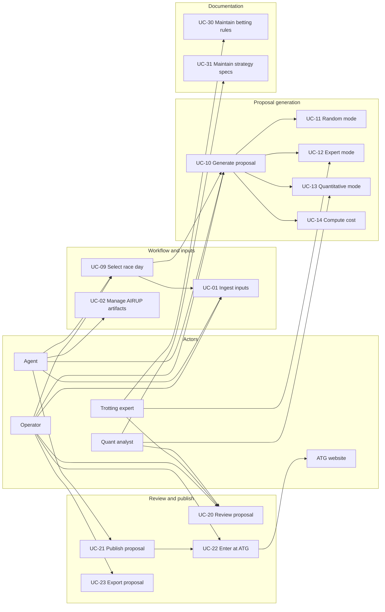

# VAI — Use-Case Model

| Field | Value |
|-------|-------|
| **Version** | 0.4 |
| **Status** | APPROVED |
| **Reviewer** | ornstein |
| **Approved** | 2026-07-07 |
| **Last updated** | 2026-07-07 |
| **Owner** | ornstein (M-004) |
| **Supersedes** | SRS §3 (functional requirements) |

Step-by-step narratives live in [use-cases/](./use-cases/). This document holds the **model**: actors, diagram, and catalog.

---

## 1. Actors

| Actor | Description | Maps to |
|-------|-------------|---------|
| **Operator** | Kricke or ornstein — generates, reviews, and manually enters proposals at ATG | M-003, M-004 |
| **Trotting expert** | Nisse — rules research, expert-mode patterns, betting doc approval | M-001 |
| **Quant analyst** | Povl — odds math, quantitative mode, simulation specs | M-002 |
| **Agent** | Grok assistant — drafts artifacts, runs generators, follows AIRUP | M-005 |
| **ATG (external)** | Manual entry target; no API integration in v1 | External system |

---

## 2. Use-case diagram



---

## 3. Use-case catalog

| ID    | Name                    | Primary actor              | Brief description                                           | Spec                                                  | Legacy FR              |
| ----- | ----------------------- | -------------------------- | ----------------------------------------------------------- | ----------------------------------------------------- | ---------------------- |
| UC-09 | Select race day         | Operator                   | DATUM/BANA/SPELFORM from ATG; auto-fetch race card          | [UC-09](./use-cases/UC-09-select-race-day.md)         | —                      |
| UC-01 | Ingest inputs           | Operator / Agent / System  | Auto-collect or manual store race cards and odds            | [UC-01](./use-cases/UC-01-ingest-inputs.md)           | FR-001a, FR-011        |
| UC-02 | Manage AIRUP artifacts  | Agent                      | Move drafts through inbox → pending → outbox; log decisions | [UC-02](./use-cases/UC-02-manage-airup-artifacts.md)  | FR-000, FR-001b–d      |
| UC-10 | Generate proposal       | Operator                   | Horse pools + SYSTEMKOSTNAD → betting slip + probabilities | [UC-10](./use-cases/UC-10-generate-proposal.md)       | FR-010–016             |
| UC-11 | Random mode (Hari)      | Operator / Agent           | Exact-budget random fill from operator pools                | [UC-11](./use-cases/UC-11-random-mode.md)             | FR-020–022             |
| UC-12 | Expert mode             | Operator / Trotting expert | Apply spik/gardering templates from expert rules            | [UC-12](./use-cases/UC-12-expert-mode.md)             | FR-030–032             |
| UC-13 | Quantitative mode       | Operator / Quant analyst   | Use odds/probabilities and optional simulation              | [UC-13](./use-cases/UC-13-quantitative-mode.md)       | FR-040–043             |
| UC-14 | Compute system cost     | Agent                      | Calculate combinations and SEK cost                         | [UC-14](./use-cases/UC-14-compute-system-cost.md)     | FR-013–014             |
| UC-15 | Display race info       | Operator                   | Race metadata in avdelning headers (ATG F-029)              | [UC-15](./use-cases/UC-15-race-info.md)               | —                      |
| UC-20 | Review proposal         | Operator / experts         | AIRUP review until APPROVED                                 | [UC-20](./use-cases/UC-20-review-proposal.md)         | FR-001b–c              |
| UC-21 | Publish proposal        | Agent                      | Copy approved proposal to `outbox/proposals/`               | [UC-21](./use-cases/UC-21-publish-proposal.md)        | FR-001c, FR-012        |
| UC-22 | Enter at ATG            | Operator                   | Manually transcribe published proposal to atg.se            | [UC-22](./use-cases/UC-22-enter-at-atg.md)            | — (human)              |
| UC-23 | Export proposal         | Operator                   | Export PDF or printable view for race day                   | [UC-23](./use-cases/UC-23-export-proposal.md)         | — (UX)                 |
| UC-30 | Maintain betting rules  | Trotting expert            | Author and approve `docs/betting/`                          | [UC-30](./use-cases/UC-30-maintain-betting-rules.md)  | FR-001, FR-050–051     |
| UC-31 | Maintain strategy specs | Quant analyst              | Author and approve `docs/strategies/`                       | [UC-31](./use-cases/UC-31-maintain-strategy-specs.md) | FR-002, FR-031, FR-042 |

**Include relationships:** UC-09 *includes* UC-01 (fetch). UC-10 *includes* UC-14. UC-10 *extends* to UC-11, UC-12, or UC-13 (mode variant).

**UX workflow:** [ux-workflow.md](./ux-workflow.md)

---

## 4. Specification template

Each file under `use-cases/` follows this structure:

```markdown
# UC-XX — Name

| Field | Value |
|-------|-------|
| **ID** | UC-XX |
| **Status** | DRAFT \| REVIEW \| APPROVED |
| **Primary actor** | … |
| **Preconditions** | … |

## Main success scenario
1. …

## Extensions
| Step | Condition | Action |
|------|-----------|--------|

## Special requirements
Link to [supplementary-specification.md](../supplementary-specification.md) sections.

## Open items
- …
```

---

## 5. Functions catalog

Full specifications: [functions.md](./functions.md). Race card schema: [race-card-schema.md](./race-card-schema.md).

### Summary by domain

| Domain | IDs | Use cases |
|--------|-----|-----------|
| ATG fetch | F-006 – F-009, F-029 | UC-01, UC-09, UC-15 |
| UX / schedule | F-025 – F-028 | UC-09, UC-10 |
| Input / storage | F-001 – F-005 | UC-01 |
| AIRUP workflow | F-010 – F-014 | UC-02, UC-20, UC-21 |
| Proposal core | F-020 – F-026 | UC-10 |
| Random mode | F-030 – F-032 | UC-11 |
| Expert mode | F-040 – F-043 | UC-12 |
| Quantitative mode | F-050 – F-054 | UC-13 |
| Cost | F-060 – F-062 | UC-14 |
| Review | F-070 – F-073 | UC-20 |
| Publish / export | F-080 – F-081, F-090 – F-092 | UC-21 – UC-23 |
| Documentation | F-100 – F-103 | UC-30, UC-31 |

### Implementation priority (v1)

| Priority | Functions |
|----------|-----------|
| Must | F-001–005, F-020–024, F-030–032, F-060–062, F-070–073, F-080 |
| Should | F-040–043, F-050–053, F-090, F-071 |
| Could | F-054, F-092 |

---

## Change log

| Version | Date | Change |
|---------|------|--------|
| 0.5 | 2026-07-08 | UC-15 race info in leg headers |
| 0.4 | 2026-07-07 | All use cases APPROVED v1.0; v1.1 Hari flow reflected |
| 0.3 | 2026-07-06 | UC-09 ATG auto-fetch; operator horse pools; SYSTEMKOSTNAD 500 SEK |
| 0.2 | 2026-07-06 | Full UC narratives; functions catalog (F-001–F-103); race card schema |
| 0.1 | 2026-07-06 | Initial model; migrated from SRS §3; spec narratives skeleton |