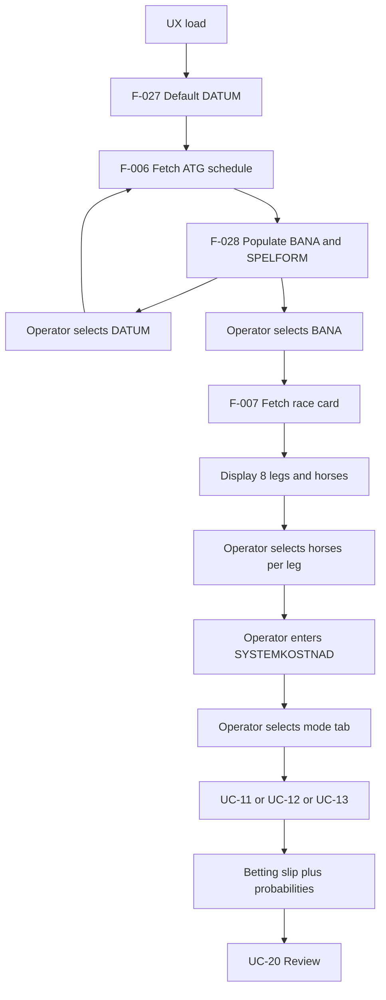

# Operator UX workflow

| Field | Value |
|-------|-------|
| **Version** | 0.1 |
| **Status** | DRAFT |
| **Owner** | Jonte (M-004) |
| **Use cases** | UC-09, UC-10, UC-11–13, UC-14 |
| **Mockup** | `outbox/mockups/v85-proposal-ux-mockup-atg.html` |

End-to-end operator flow for race-day proposal generation.

---

## Flow overview

---

## Step 1 — Race day selection (UC-09)

When the operator opens the app:

1. **DATUM** defaults to the **next relevant V85 round** on ATG:
   - Today's V85 if the round is **not fully settled** (at least one leg lacks official result).
   - Otherwise the **next future** V85 date listed on ATG.
2. Changing **DATUM** triggers a fresh fetch; **BANA** and **SPELFORM** dropdowns repopulate from ATG data.
3. **SPELFORM** defaults to **V85**; other games are future scope.
4. **BANA** lists track(s) for the chosen date and game.

---

## Step 2 — Race card and horse selection

1. System **automatically** loads the race card (startlista) for the selected DATUM + BANA + SPELFORM.
2. UX shows all 8 legs with eligible start numbers.
3. Operator **marks which horses** to include in the pool for the active model (per leg). Unmarked horses are excluded from generation for that run.
4. Operator may switch mode tab (Random / Expert / Quantitative); horse marks may be kept or reset *(TBD — default: keep marks)*.

---

## Step 3 — Stake budget and model run

1. Operator enters **SYSTEMKOSTNAD** (target system budget in SEK).
   - **Default: 500 SEK**
   - This is the budget the model optimizes against (not the per-row ATG minimum alone).
2. Operator triggers generation; selected mode (UC-11 / UC-12 / UC-13) runs on **operator-selected horse pools** within **SYSTEMKOSTNAD**.
3. System outputs:
   - **Betting slip** — final leg selections (spik/gardering) and row breakdown
   - **Model probability** — hit probabilities per quantitative.md (all modes show summary where applicable)
   - **Computed cost** — actual system cost (F-061); must be ≤ SYSTEMKOSTNAD unless operator overrides

---

## UX field mapping

| UX label (mockup) | Requirement | Default |
|-------------------|-------------|---------|
| DATUM | ISO date; drives fetch | Next V85 per F-027 |
| BANA | Track dropdown from ATG | First available or last used |
| SPELFORM | Game dropdown | V85 |
| Läge | Mode tab: Random / Expert / Quantitative | Quantitative |
| Avdelningar | Leg grid; horse toggles | From race card |
| SYSTEMKOSTNAD | Operator budget SEK | **500** |
| Systemkostnad (computed) | ∏(horses)×0.50 SEK | After model run |
| Träffsannolikhet | Model hit probs | After model run |

---

## Change log

| Version | Date | Change |
|---------|------|--------|
| 0.1 | 2026-07-06 | Initial workflow per operator specification |