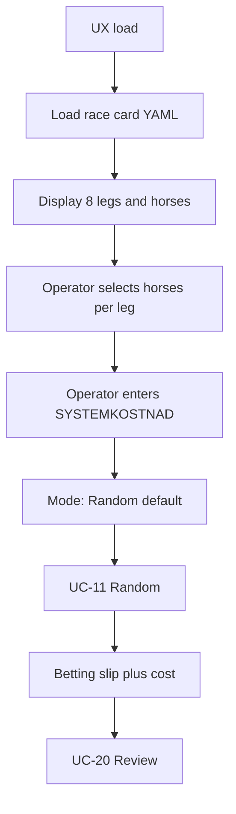

# Operator UX workflow

| Field | Value |
|-------|-------|
| **Version** | 0.2 |
| **Status** | DRAFT |
| **Owner** | Jonte (M-004) |
| **Use cases** | UC-09, UC-10, UC-11–13, UC-14 |
| **Mockup** | `outbox/mockups/v85-proposal-ux-mockup-atg.html` (v0.5) |
| **v1 scope** | [scope-lock-v1-random.md](../../outbox/specs/scope-lock-v1-random.md) |

End-to-end operator flow for race-day proposal generation.

---

## Flow overview

**v1:** race card from manual YAML; **v1.1 local UI** serves mockup + API ([local-ui-v1.1](../../pending/specs/local-ui-v1.1.md)). **Later:** UC-09 ATG auto-fetch for DATUM/BANA.

---

## Step 1 — Race day selection

**v1 (manual):** operator picks date/track matching a YAML file in `inbox/race-cards/`.

**Future (UC-09):** DATUM defaults to next V85 per F-027; BANA/SPELFORM from ATG fetch.

---

## Step 2 — Race card and horse selection

1. System loads race card for selected date + track.
2. UX shows all 8 legs with eligible start numbers.
3. Operator **marks horses** in the candidate pool per leg (F-026). Unmarked horses are excluded.
4. **Läge:** Random active by default; Expert and Kvantitativ disabled (*Kommer senare*).

---

## Step 3 — Stake budget and model run

1. Operator enters **SYSTEMKOSTNAD** — default **500 SEK** (F-025).
2. Operator triggers **Generera system**; UC-11 runs on operator pools within budget.
3. Outputs: betting slip, computed cost (F-061), combination breakdown. Hit probabilities optional in random v1.

---

## UX field mapping

| UX label (mockup) | Requirement | Default (v1) |
|-------------------|-------------|--------------|
| DATUM | ISO date | From available YAML cards |
| BANA | Track | From card `track` field |
| SPELFORM | Game dropdown | V85 |
| Läge | Random / Expert / Kvantitativ | **Random** |
| Avdelningar | Leg grid; horse toggles | From race card |
| SYSTEMKOSTNAD | Operator budget SEK | **500** |
| Systemkostnad (computed) | ∏(horses)×0.50 SEK | After UC-11 |
| Träffsannolikhet | Model hit probs | N/A random v1 |

---

## Change log

| Version | Date | Change |
|---------|------|--------|
| 0.2 | 2026-07-07 | v1: manual YAML, Random default; ATG fetch deferred |
| 0.1 | 2026-07-06 | Initial workflow per operator specification |