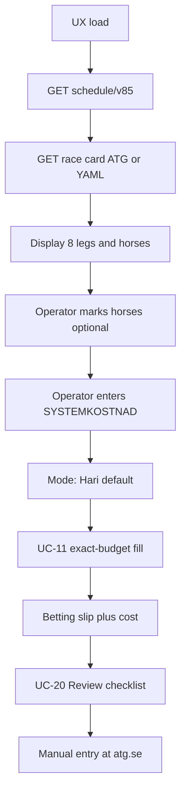

# Operator UX workflow

| Field | Value |
|-------|-------|
| **Version** | 1.0 |
| **Status** | APPROVED |
| **Reviewer** | Jonte (operator) |
| **Approved** | 2026-07-07 |
| **Last updated** | 2026-07-07 |
| **Owner** | Jonte (M-004) |
| **Use cases** | UC-09, UC-10, UC-11–13, UC-14 |
| **Mockup** | `outbox/mockups/v85-proposal-ux-mockup-atg.html` (v1.1) |
| **Specs** | [random-v1.1](../../outbox/specs/random-v1.1.md), [local-ui-v1.1](../../outbox/specs/local-ui-v1.1.md), [atg-data-source](../../outbox/specs/atg-data-source.md) |

End-to-end operator flow for race-day proposal generation.

---

## Flow overview

---

## Step 1 — Race day selection

**v1.1:** DATUM and BANA from `GET /api/v1/schedule/v85`; race card loaded by ATG `game_id`.

**Fallback:** manual YAML in `inbox/race-cards/` via local file listing.

---

## Step 2 — Race card and horse selection

1. System loads race card for selected date + track.
2. UX shows all 8 legs with eligible start numbers (scratches disabled).
3. Operator **may mark** horses to lock before generate (F-026). Empty leg = slumpen väljer.
4. **Frys avd.** fixes leg to marked horses only.
5. **Läge:** **Hari** active; Expert and Kvantitativ disabled (*Kommer senare*).

---

## Step 3 — Stake budget and model run

1. Operator enters **SYSTEMKOSTNAD** — default **500 SEK** (F-025).
2. Optional **seed** for reproducibility.
3. **Generera system** → UC-11 fills to **exact** budget when possible.
4. On `BUDGET_NOT_MET`: confirm dialog offers **nearest achievable** stake.
5. Outputs: betting slip, cost (F-061), breakdown, optional hit bars (F-052 when ATG distributions exist).

---

## UX field mapping

| UX label (mockup) | Requirement | Default (v1.1) |
|-------------------|-------------|----------------|
| DATUM | ISO date | ATG `default_date` |
| BANA | Track / game_id | From schedule |
| SPELFORM | Game dropdown | V85 only (V75 discontinued at ATG) |
| Läge | Hari / Expert / Kvantitativ | **Hari** |
| Avdelningar | Leg grid; horse toggles | From race card |
| SYSTEMKOSTNAD | Operator budget SEK | **500** |
| Systemkostnad (computed) | Exact match when OK | After UC-11 |
| Träffsannolikhet | F-052 basic | When ATG bet % present |
| Innan spel | UC-20 checklist | Wired to slip + card |

---

## Change log

| Version | Date | Change |
|---------|------|--------|
| 1.0 | 2026-07-07 | APPROVED — v1.1 operator flow; matches shipped mockup and local UI |
| 0.3 | 2026-07-07 | v1.1: ATG schedule/cards, Hari, exact budget, nearest stake, F-052 |
| 0.2 | 2026-07-07 | v1: manual YAML, Random default; ATG fetch deferred |
| 0.1 | 2026-07-06 | Initial workflow per operator specification |